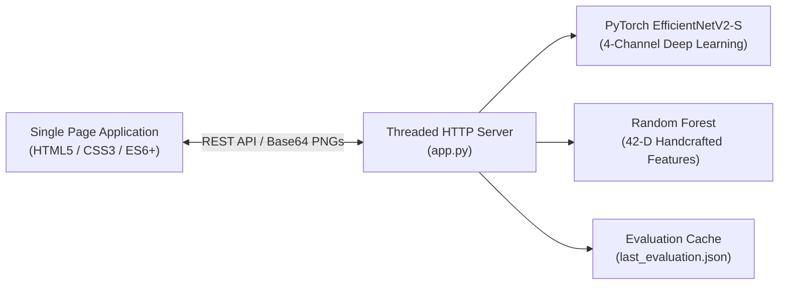

# PureForest Tree Species Verification & Classification Platform

[](https://www.python.org/downloads/)
[](https://opensource.org/licenses/MIT)
[](https://pytorch.org/)

An interactive, high-performance web platform and deep learning evaluation sandbox for tree species classification from 4-channel Very High Resolution (VHR) aerial imagery (Near-Infrared, Red, Green, Blue) on the benchmark **PureForest** dataset.

---

## 1. What This Repository Holds

This repository contains the full source code and engineering documentation for the PureForest Model Verification Webapp:
- **Web Application Backend (`app.py`)**: A multithreaded Python HTTP server providing REST API endpoints for single-patch predictions, asynchronous bulk dataset evaluations, on-demand NIR/RGB tile rendering, and evaluation caching.
- **Frontend SPA Dashboard (`public/`)**: A responsive, dark-mode glassmorphic user interface featuring drag-and-drop verification, interactive 13x13 confusion matrix heatmaps, per-class statistical analytics, and a multi-channel Lightbox viewer.
- **Machine Learning Pipelines**:
  - `train_efficientnet.py`: A deep learning pipeline adapting **EfficientNetV2-S** for 4-channel multi-spectral inputs with Red-to-NIR weight transfer, Mixup augmentation, and label smoothing.
  - `train_classifier.py`: A classical machine learning baseline training a **Random Forest Classifier** on 42-dimensional spectral, NDVI, and histogram features.
- **Metadata Dictionaries (`Metadata/`)**: Bilingual French-English taxonomic dictionaries linking 18 botanical tree species to 13 target semantic classes.
- **Automated Test Suite (`tests/`)**: Unit and integration test cases covering feature extraction, filename regex parsing, model architectures, and data structures.
- **Documentation Suite (`docs/`)**: Detailed system design, software architecture, data schemas, API specifications, PRDs, and deployment manuals.

---

## 2. Key Files to Look at First

| File | Purpose & Role |
|---|---|
| [`app.py`](file:///Users/sooyauming/Desktop/Intern/Forestation%202/app.py) | **Primary Application Entry Point**: Starts the web server, handles API requests, and executes model inference. |
| [`public/app.js`](file:///Users/sooyauming/Desktop/Intern/Forestation%202/public/app.js) | **Frontend Controller**: Manages UI state, async API polling, image rendering, and matrix analytics. |
| [`train_efficientnet.py`](file:///Users/sooyauming/Desktop/Intern/Forestation%202/train_efficientnet.py) | **Deep Learning Pipeline**: Trains and fine-tunes the 4-channel EfficientNetV2-S model. |
| [`train_classifier.py`](file:///Users/sooyauming/Desktop/Intern/Forestation%202/train_classifier.py) | **Baseline Pipeline**: Extracts 42-D handcrafted features and trains the Random Forest classifier. |
| [`requirements.txt`](file:///Users/sooyauming/Desktop/Intern/Forestation%202/requirements.txt) | **Dependencies**: Lists required Python packages. |
| [`tests/test_app.py`](file:///Users/sooyauming/Desktop/Intern/Forestation%202/tests/test_app.py) | **Automated Tests**: Unit tests verifying core application logic. |

---

## 3. Architecture & System Overview



The system provides real-time multi-spectral imagery inspection:
- **True Color (RGB)**: Visualizes Red, Green, and Blue spectral bands.
- **False Color (CIR)**: Maps Near-Infrared (NIR) to the Red channel, highlighting vegetation health and canopy density.

---

## 4. Quick Start Guide

### Step 1: Environment Setup
```bash
# Clone or navigate to the repository
cd "Forestation 2"

# Create and activate a virtual environment
python3 -m venv venv
source venv/bin/activate  # On Windows: .\venv\Scripts\Activate.ps1

# Install dependencies
pip install -r requirements.txt
```

### Step 2: Start the Web Application
```bash
python3 app.py
```
Open your browser and navigate to **`http://localhost:8080`**.

---

## 5. Running Automated Tests

Run the complete test suite:
```bash
python3 -m unittest discover -s tests -p "test_*.py" -v
```
Or using pytest:
```bash
pytest tests/ -v
```

---

## 6. Comprehensive Documentation Index

Explore our comprehensive documentation suite in the [`docs/`](file:///Users/sooyauming/Desktop/Intern/Forestation%202/docs/) directory:

- 📐 [**System Design Document**](file:///Users/sooyauming/Desktop/Intern/Forestation%202/docs/system_design.md): High-level system design, block diagrams, dataflow, and concurrency model.
- 🏗️ [**Software Architecture & ML Pipelines**](file:///Users/sooyauming/Desktop/Intern/Forestation%202/docs/architecture.md): Deep Learning stem adaptation, weight transfer, and Random Forest feature formulas.
- 🗄️ [**Data Schema & Metadata Specification**](file:///Users/sooyauming/Desktop/Intern/Forestation%202/docs/database_schema.md): Data dictionaries, file regex formats, in-memory state, and payload contracts.
- 🚀 [**Getting Started Guide**](file:///Users/sooyauming/Desktop/Intern/Forestation%202/docs/getting_started.md): Step-by-step setup, UI navigation, and model training instructions.
- 📡 [**REST API Reference**](file:///Users/sooyauming/Desktop/Intern/Forestation%202/docs/api_reference.md): Complete specifications for all API endpoints, parameters, and responses.
- 🧪 [**Testing & Debugging Guide**](file:///Users/sooyauming/Desktop/Intern/Forestation%202/docs/testing_and_debugging.md): Test execution, TIFF band validation, and troubleshooting scenarios.
- 🚢 [**Deployment & Release Manual**](file:///Users/sooyauming/Desktop/Intern/Forestation%202/docs/deployment_and_release.md): Docker containerization, systemd service, and release procedures.
- 📋 [**PRD & Architectural Decisions (ADRs)**](file:///Users/sooyauming/Desktop/Intern/Forestation%202/docs/prd_and_design_decisions.md): Requirements, trade-offs, and benchmark comparisons with literature.

---

## 7. Dataset Summary & Class Mapping

The PureForest dataset spans **339 km²** across **449 distinct monospecific forests** in 40 French departments. The 18 tree species are grouped into 13 semantic classes:

| Class ID | Semantic Class Name | Constituent Latin Species |
|:---:|---|---|
| **0** | Deciduous oak | *Quercus robur*, *Quercus pubescens*, *Quercus petraea*, *Quercus rubra* |
| **1** | Evergreen oak | *Quercus ilex* |
| **2** | Beech | *Fagus sylvatica* |
| **3** | Chestnut | *Castanea sativa* |
| **4** | Black locust | *Robinia pseudoacacia* |
| **5** | Maritime pine | *Pinus pinaster* |
| **6** | Scotch pine | *Pinus sylvestris* |
| **7** | Black pine | *Pinus nigra laricio*, *Pinus nigra* |
| **8** | Aleppo pine | *Pinus halepensis* |
| **9** | Fir | *Abies nordmanniana*, *Abies alba* |
| **10** | Spruce | *Picea abies* |
| **11** | Larch | *Larix decidua* |
| **12** | Douglas | *Pseudotsuga menziesii* |

---

## 8. Maintainers & External References

- **Maintainer**: Soo Yau Ming (`yauming.soo@qiu.edu.my`)
- **Dataset Reference**: *PureForest: A multimodal dataset for tree species classification in metropolitan France*
- **License**: MIT License
