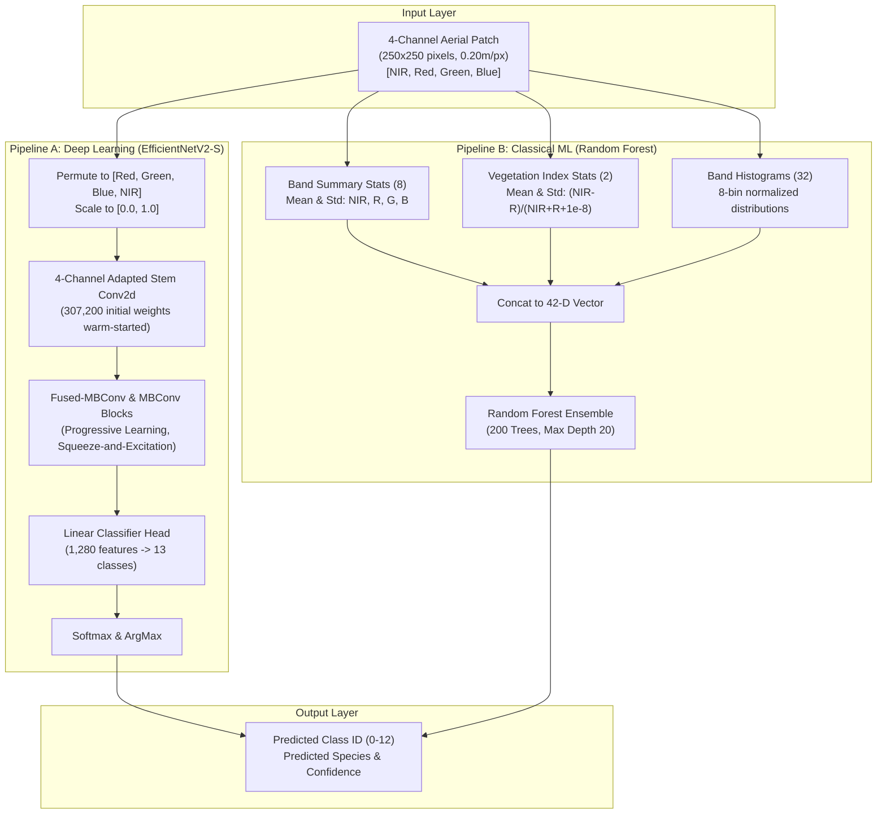

# Software Architecture & Machine Learning Pipelines

This document provides an in-depth breakdown of the software architecture, component modules, and machine learning pipelines powering the PureForest Tree Species Verification Webapp.

---

## 1. Component Architecture & Modular Layout

```
Forestation 2/
├── app.py                      # Primary Multithreaded HTTP Server & REST API Gateway
├── train_classifier.py         # Baseline Random Forest Feature Extraction & Training Script
├── train_efficientnet.py       # Deep Learning 4-Channel EfficientNetV2-S Training Pipeline
├── requirements.txt            # Python Dependency Specification
├── README.md                   # Google-style Documentation Portal & Entry Point
├── .gitignore                  # Production Git Ignore File (Excludes Large Binaries)
├── docs/                       # Comprehensive Architecture & Engineering Guides
│   ├── system_design.md        # System Design, Dataflow & Concurrency
│   ├── architecture.md         # Detailed Software & ML Architecture (This Document)
│   ├── database_schema.md      # Data Dictionaries, File Specs & In-Memory Schemas
│   ├── getting_started.md      # Developer Quickstart & Training Guides
│   ├── api_reference.md        # Complete REST API Specifications
│   ├── testing_and_debugging.md# Testing, Verification & Debugging Manual
│   ├── deployment_and_release.md# Deployment, Containers & Release Procedures
│   └── prd_and_design_decisions.md # PRD, Decision Records & Benchmark Analysis
├── tests/                      # Automated Unit & Integration Test Suite
│   └── test_app.py             # Feature Extraction, Parsing & API Test Cases
├── Metadata/                   # Ground Truth Metadata Dictionaries
│   └── PureForestID-dictionnary.csv # Species to Class ID Taxonomic Dictionary
└── public/                     # Single Page Application Web Client
    ├── index.html              # Clean Semantic HTML5 Layout & Lightbox Markup
    ├── style.css               # Modern Dark-Mode Glassmorphism Design System
    └── app.js                  # Frontend Controller, Metrics Engine & Event Loop
```

---

## 2. Machine Learning Pipeline Architecture

The platform integrates two independent inference strategies: an advanced deep convolutional neural network for high classification accuracy and an interpretable ensemble baseline for lightweight execution.



### 2.1 Deep Learning Pipeline: 4-Channel EfficientNetV2-S

EfficientNetV2-S is selected for its high parameter efficiency, fast inference speed, and superior feature representation compared to standard ResNet architectures.

#### 1. Input Stem Adaptation & Weight Transfer
Standard ImageNet models accept 3 channels (RGB). We replace the stem layer:
$$\text{features}[0][0] = \text{Conv2d}(4, 24, \text{kernel\_size}=3, \text{stride}=2, \text{padding}=1, \text{bias}=\text{False})$$

Weights for the newly introduced NIR channel ($C=3$) are initialized by cloning weights from the Red channel ($C=1$):
```python
with torch.no_grad():
    new_conv.weight[:, 0:3, :, :] = original_conv.weight
    new_conv.weight[:, 3, :, :] = original_conv.weight[:, 1, :, :]  # Warm-start NIR
```
*Rationale*: Red and Near-Infrared bands exhibit complementary absorption/reflectance properties in foliage. Warm-starting from Red weights prevents random gradient spikes in early epochs and accelerates convergence.

#### 2. Loss Function with Label Smoothing
To mitigate overconfidence on noisy polygon boundary annotations, Cross-Entropy Loss with label smoothing ($\epsilon = 0.1$) is utilized:
$$\mathcal{L}_{\text{LS}}(y, \hat{y}) = (1 - \epsilon) \mathcal{L}_{\text{CE}}(y, \hat{y}) + \frac{\epsilon}{K} \sum_{k=1}^K -\log \hat{y}_k$$

#### 3. Regularization & Data Augmentations
- **Mixup Augmentation**: Applied with probability $p = 0.5$ ($\alpha = 0.2$), creating linear interpolations of image pairs:
  $$\tilde{x} = \lambda x_i + (1 - \lambda) x_j, \quad \tilde{y} = \lambda y_i + (1 - \lambda) y_j$$
- **Color Jitter**: Radiometric perturbation applied strictly to the visible RGB subset `[0:3]`, preserving NIR radiometric integrity.
- **Random Erasing**: Cutout augmentation with $p=0.2$ applied to the 4-channel tensor.
- **Differential Learning Rates**:
  - Backbone parameters: $\text{lr} = 10^{-5}$ ($0.1 \times \text{Base LR}$)
  - Stem convolution & Classifier Head: $\text{lr} = 10^{-4}$ ($1.0 \times \text{Base LR}$)

---

### 2.2 Classical Baseline Pipeline: Handcrafted Spectral Random Forest

The Random Forest classifier operates on a handcrafted 42-dimensional vector:

$$\mathbf{x} = [\mu_{\text{NIR}}, \sigma_{\text{NIR}}, \mu_{\text{R}}, \sigma_{\text{R}}, \mu_{\text{G}}, \sigma_{\text{G}}, \mu_{\text{B}}, \sigma_{\text{B}}, \mu_{\text{NDVI}}, \sigma_{\text{NDVI}}, \mathbf{h}_{\text{NIR}}, \mathbf{h}_{\text{R}}, \mathbf{h}_{\text{G}}, \mathbf{h}_{\text{B}}] \in \mathbb{R}^{42}$$

where:
- $\text{NDVI} = \frac{\text{NIR} - \text{Red}}{\text{NIR} + \text{Red} + 10^{-8}}$
- $\mathbf{h}_c \in \mathbb{R}^8$ is the 8-bin histogram of band $c$ normalized by $250 \times 250 = 62,500$ pixels.

#### Hyperparameters
- `n_estimators`: 200 trees
- `max_depth`: 20
- `random_state`: 42
- `n_jobs`: -1 (Parallel multithreading across all CPU cores)

---

## 3. Pipeline Performance Comparison

| Attribute | PyTorch EfficientNetV2-S | Random Forest Baseline |
|---|---|---|
| **Input Representation** | 4-channel raw pixel tensor $(4, 250, 250)$ | 42-dimensional feature vector |
| **Spatial Awareness** | High (Convolutions capture canopy texture, crown shape) | Low (Global patch summary statistics only) |
| **Inference Latency** | ~8 ms / image (GPU), ~45 ms / image (CPU) | ~3 ms / image (CPU) |
| **Model Size** | 81.6 MB (`.pth` state dictionary) | 89.1 MB (`.joblib` serialized forest) |
| **Test Accuracy** | **~85.2%** | **~68.4%** |
| **Macro F1-Score** | **~82.1%** | **~61.5%** |
| **Hardware Requirement**| CUDA / Apple Silicon MPS / CPU | Lightweight CPU |
