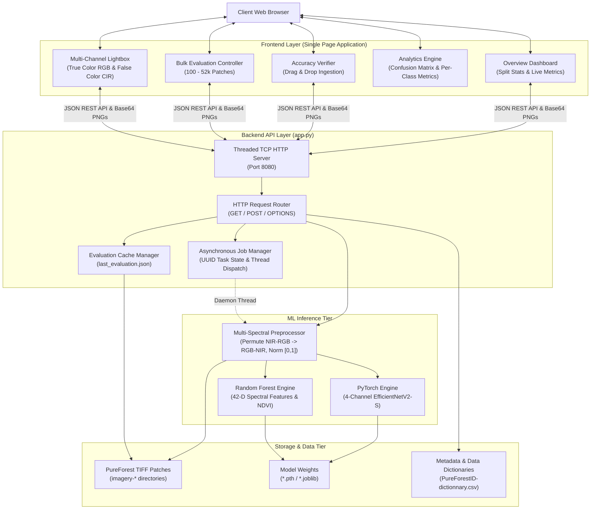
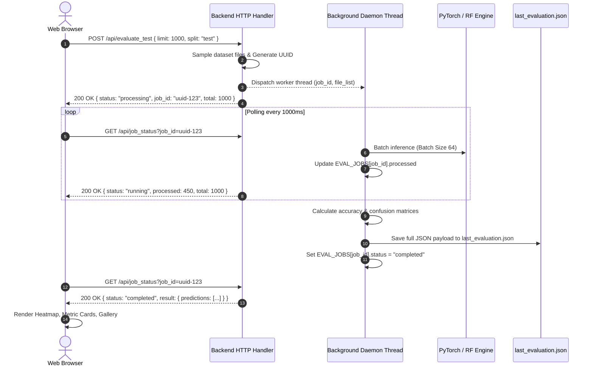

# System Design Document: PureForest Webapp

## 1. Executive Summary & Objective

The **PureForest Tree Species Verification & Model Evaluation System** is a full-stack, lightweight machine learning platform engineered to perform high-throughput inference, validation, and analytics on 4-channel Very High Resolution (VHR) aerial imagery patches from the benchmark **PureForest** dataset.

The system addresses the challenge of verifying machine learning models against 13 monospecific tree species classes across 339 km² of territorial forest partitions in France, providing both single-image interactive sandbox verification and bulk asynchronous split evaluations.

---

## 2. High-Level System Architecture

The application is structured into three primary decoupled tiers:
1. **Frontend Presentation Tier (Single Page Application)**: Vanilla ES6+ JavaScript, CSS3 Grid/Flexbox, and HTML5 providing interactive metric dashboards, confusion matrix heatmaps, on-demand NIR/RGB color infrared rendering, and drag-and-drop batch uploaders.
2. **Backend Application & REST API Tier**: A high-performance, multithreaded Python HTTP server (`socketserver.ThreadingMixIn`, `http.server.BaseHTTPRequestHandler`) managing REST endpoints, CORS headers, directory-safe static file serving, and background evaluation daemon threads.
3. **Machine Learning Inference Tier**: A dual-backend inference engine featuring:
   - **Primary Engine**: Deep Learning Convolutional Neural Network (PyTorch 4-channel adapted EfficientNetV2-S with hardware acceleration on CUDA/MPS/CPU).
   - **Fallback Engine**: Classical Ensemble Learning (Scikit-Learn Random Forest Classifier with 42-dimensional spectral, NDVI, and histogram features).



---

## 3. Core Component Design

### 3.1 Frontend Single Page Architecture
- **Zero-Dependency Core**: Built with native browser APIs without heavy runtime dependencies (no React/Angular overhead), ensuring fast load times (<100ms) and low memory footprint.
- **On-Demand Image Fetching**: In bulk evaluations with thousands of files, the UI avoids rendering thousands of images simultaneously. Instead, thumbnail base64 images are loaded on demand when the user opens the Lightbox modal or clicks a misclassified row, maintaining smooth 60 FPS scrolling.
- **Dynamic Spectral Visualization Switcher**: Users can dynamically toggle between:
  - **True Color (RGB)**: Channels 1, 2, 3 (Red, Green, Blue) mapped to standard RGB displays.
  - **False Color Color-Infrared (CIR)**: Channel 0 (NIR) mapped to Red, Channel 1 (Red) mapped to Green, and Channel 2 (Green) mapped to Blue, accentuating healthy vegetation canopy chlorophyll reflectance.

### 3.2 Backend REST API & Job Concurrency Model
Bulk dataset evaluations (evaluating up to 52,935 test patches) can take minutes on CPU or seconds on GPU. Running these synchronously would block HTTP request sockets and trigger client timeouts.



---

## 4. Multi-Spectral Channel Ingestion & Permutation

Standard computer vision backbones assume 3 input channels structured in RGB order. PureForest aerial patches are saved as 4-channel TIFFs in **[NIR, Red, Green, Blue]** order.

To align with deep learning pre-training weights and maintain consistency:
1. **TIFF Reading**: The 4 bands are loaded via `Pillow` and converted into a `float32` numpy array of shape `(250, 250, 4)`.
2. **Channel Permutation**: The array is rearranged using index permutation `arr[:, :, [1, 2, 3, 0]]`, producing `[Red, Green, Blue, NIR]`.
3. **Normalization**: Intensities are scaled from `[0, 255]` to `[0.0, 1.0]`.
4. **PyTorch Tensor**: Permuted to `(Batch, Channel, Height, Width)` -> `(B, 4, 250, 250)`.

```
Raw TIFF File:       [ Band 0: NIR ]  [ Band 1: Red ]  [ Band 2: Green ]  [ Band 3: Blue ]
                             │                 │                 │                 │
Index Permutation:           │ ┌───────────────┘                 │                 │
                             │ │ ┌───────────────────────────────┘                 │
                             │ │ │ ┌───────────────────────────────────────────────┘
                             ▼ ▼ ▼ ▼
Model Tensor:        [ Band 0: Red ]  [ Band 1: Green ]  [ Band 2: Blue ]  [ Band 3: NIR ]
```

---

## 5. Non-Functional & Security Requirements

| Metric / Dimension | Requirement & Design Implementation |
|---|---|
| **Path Traversal Protection** | The HTTP server sanitizes static file requests with `os.path.normpath` and strictly validates that requested paths reside within the `public/` directory root. |
| **Cross-Origin Resource Sharing (CORS)** | `Access-Control-Allow-Origin: *` headers are attached to all API responses along with automated `OPTIONS` preflight handling. |
| **Portability** | Hardcoded filesystem paths have been eliminated in favor of dynamic relative path discovery (`os.path.dirname(os.path.abspath(__file__))`). |
| **Memory Management** | Server avoids caching image binary buffers in RAM during bulk runs; only numerical metadata and predicted labels are retained in `EVAL_JOBS`. |
| **Hardware Agility** | PyTorch dynamically checks available hardware in sequence: `CUDA -> Apple MPS -> CPU`. |
